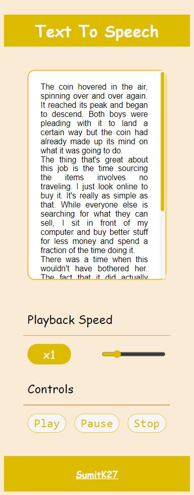
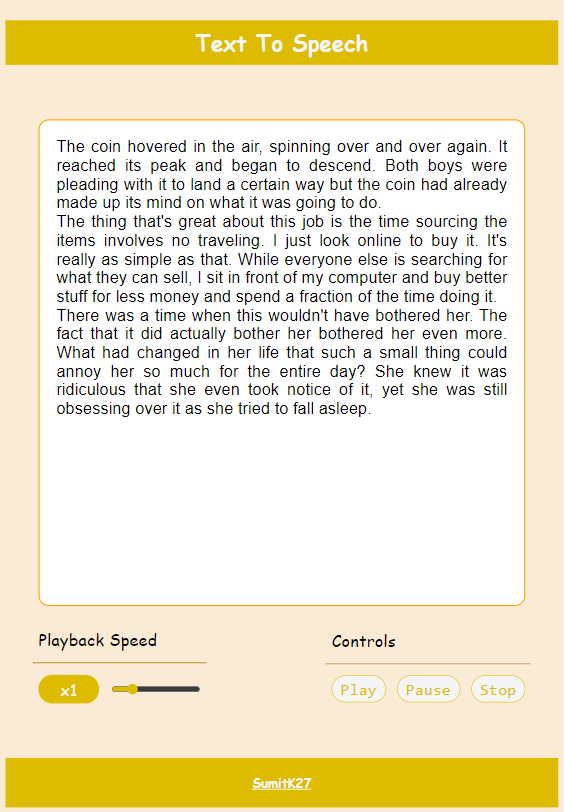
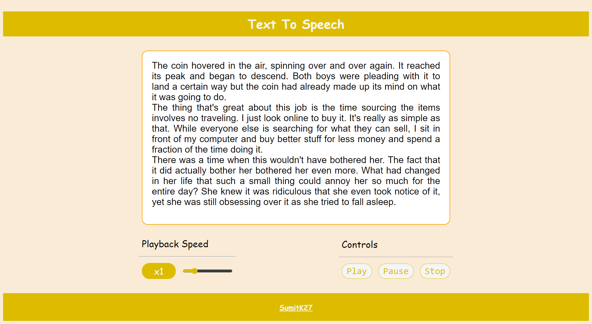

# **Text To Speech**

A Vanilla JavaScript based text-to-speech app that reads the text for you.

## **Technology Used**

-   HTML
-   CSS (w/ flex box & media queries)
-   JavaScript (Speech Synthesis)

## **Demo**

Live URL - [Github Pages](https://sumitk27.github.io/JS-Text-To-Speech/)

## **Screenshots**

**Mobile**

**Tablet**

**Desktop**

